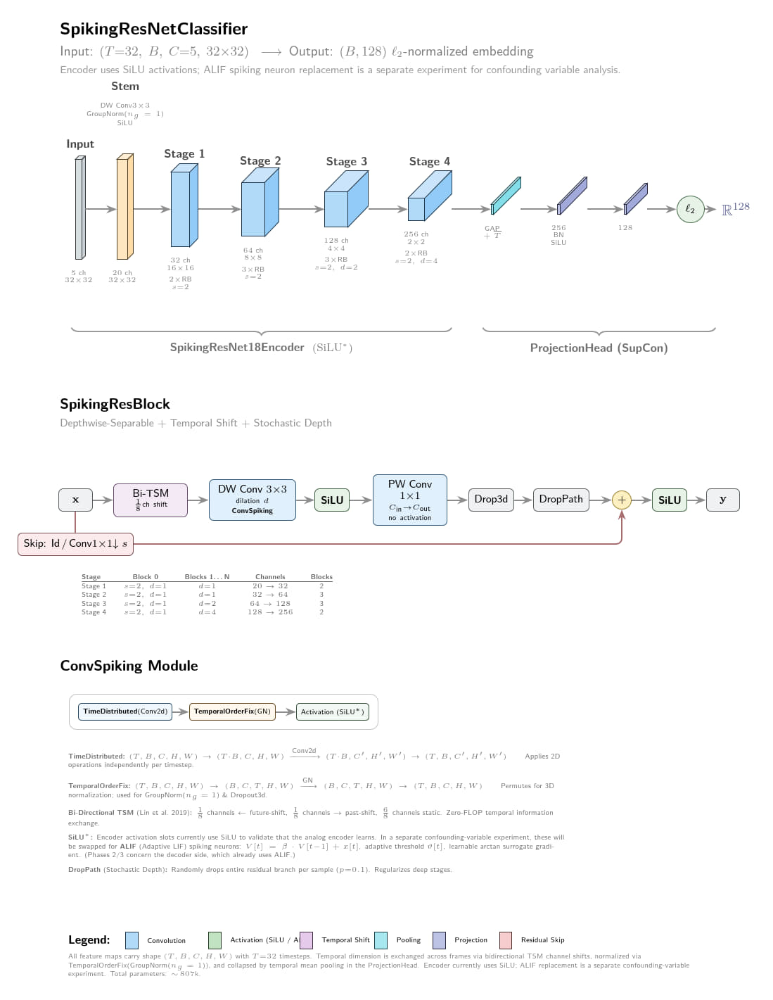
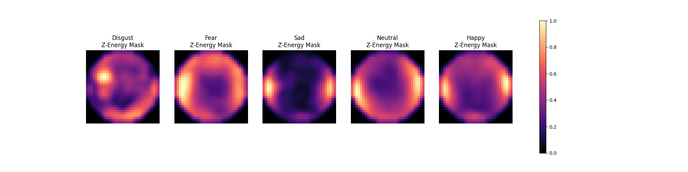
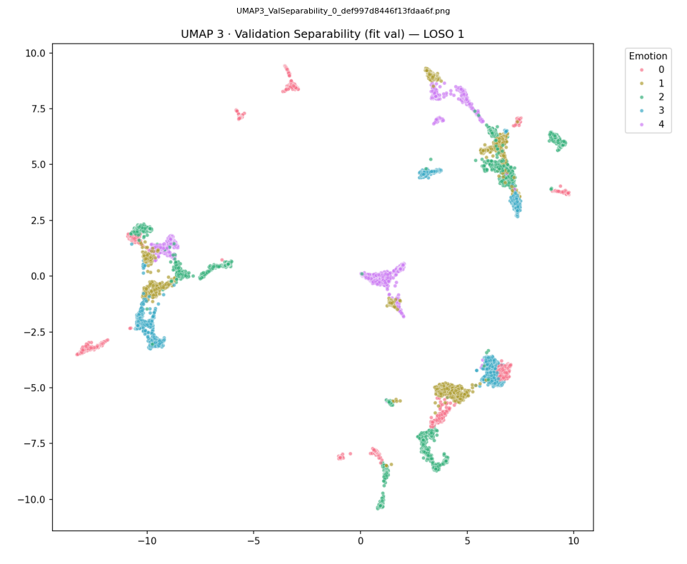
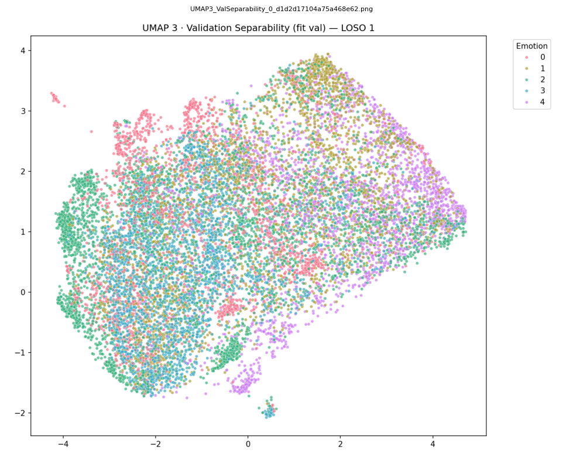
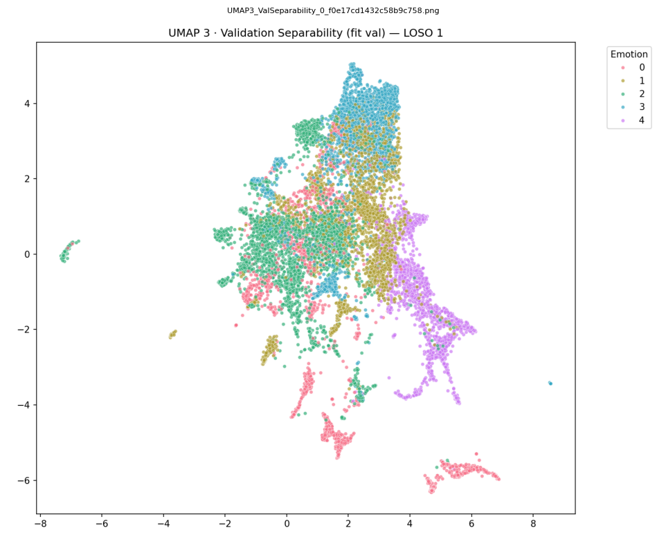

<div align="center">

# 🧠 SWEEP-Net
**Spiking Weakly-supervised EEG Emotion Prototyping Network**

[]()
[]()
[]()

*A parameter-efficient, spatiotemporal encoder for cross-subject EEG emotion recognition, designed for eventual distillation into a Spiking Neural Network (SNN).*

[Milestone 1 Notebook](milestones/Project%20Milestone%201.ipynb) · [Milestone 2 Notebook](milestones/Project%20Milestone%202.ipynb)

</div>

---

## Table of Contents

1. [Overview](#overview)
2. [The Cross-Subject Problem](#the-cross-subject-problem)
3. [Architecture](#architecture)
4. [Preprocessing Pipeline](#preprocessing-pipeline)
5. [Training Framework](#training-framework)
6. [Key Experiments & Findings](#key-experiments--findings-milestone-2)
7. [Project Structure](#project-structure)
8. [Getting Started](#getting-started)
9. [Configuration System](#configuration-system)
10. [Roadmap](#roadmap)

---

## Overview

EEG-based emotion recognition faces a fundamental bottleneck: **models memorize the subject's biometric skull geometry** rather than learning the underlying emotional signal. A network trained on 15 subjects will achieve >90% accuracy on those same subjects, but performance collapses to near-chance (~30%) on an unseen 16th subject.

SWEEP-Net is a research framework that systematically attacks this domain gap through a combination of:

- **Session-Level Euclidean Alignment (EA)** to mathematically erase each subject's spatial covariance fingerprint before it enters the network
- **Supervised Momentum Contrast (SupMoCo)** with Decoupled Contrastive Learning for robust representation learning
- **Leave-One-Trial-Out (LOTO) masking** to prevent the loss function from punishing physiologically identical timepoints within the same video trial
- A custom **Atrous-MobileNet encoder** (<1M parameters) processing 5D CWT topomaps with temporal shift modules

The project uses the [SEED-V](https://bcmi.sjtu.edu.cn/home/seed/) dataset (16 subjects, 5 emotions, 62-channel EEG).

---

## The Cross-Subject Problem

Standard contrastive learning on EEG data suffers from **shortcut learning**: the network discovers that the fastest way to minimize the loss is to cluster samples by *who* recorded them, not by *what emotion* they felt. This happens because each subject's skull thickness, electrode impedance, and baseline neural rhythms create a unique biometric fingerprint that dominates the signal.

We decompose subject identity in EEG into two components:

| Component | What it is | Can we remove it? |
|-----------|-----------|-------------------|
| **Spatial Covariance (The Skull)** | Electrode impedance, skull geometry, scalp conductance | ✅ Yes — Euclidean Alignment (EA) maps every session to the Identity matrix |
| **Temporal Rhythms (The Tempo)** | Individual Alpha Frequency (IAF), resting baseline hums | ❌ Not without destroying the emotion signal itself |

This distinction is the central finding of Milestone 2 and drives the entire architecture design.

---

## Architecture

<div align="center">
  
  <p><i>Full encoder architecture with SpikingResBlock detail and ConvSpiking module breakdown.</i></p>
</div>

The encoder is a **4-stage Atrous-MobileNet** built entirely from depthwise-separable convolutions:

| Component | Description |
|-----------|-------------|
| **Stem** | DW Conv3×3 → InstanceNorm3d → SiLU |
| **Stages 1–4** | Depthwise-separable residual blocks with increasing dilation `[1, 1, 2, 4]` and channels `[32, 64, 128, 256]` |
| **Bi-TSM** | Bidirectional Temporal Shift Module — zero-FLOP temporal modelling across 32 frames by channel shifting |
| **ODConv** | Omni-Dimensional Dynamic Convolutions — 4-expert dynamic routing that adapts to transient emotional topologies |
| **Projection Head** | GAP → BN → SiLU → Linear(256→128) → ℓ₂-normalize |

**Input shape:** `(T=32, B, C=5, H=32, W=32)` — 32 timesteps of 5-band CWT topomaps on a 32×32 spatial grid.  
**Output:** 128D ℓ₂-normalized embedding.  
**Total parameters:** ~807K.

---

## Preprocessing Pipeline

Raw 62-channel EEG undergoes the following offline transformation in `generate_dataset.py`:

```
Raw 1D EEG (62ch × T samples)
    │
    ├── 1. Session-Level Euclidean Alignment (EA)
    │       Compute mean spatial covariance R per session
    │       Multiply raw signal by R^{-1/2} → forces baseline to Identity matrix
    │
    ├── 2. Continuous Wavelet Transform (CWT)
    │       5 frequency bands (Delta, Theta, Alpha, Beta, Gamma)
    │       Produces (62ch × 5bands × T) power spectrogram
    │
    ├── 3. log1p + IQR Robust Scaling
    │       Eliminates 1/f power law imbalance
    │       Clips at ±4 IQR to suppress outliers
    │
    ├── 4. Windowing
    │       200-sample windows with 100-sample overlap
    │       Interpolated to 32 temporal steps
    │
    └── 5. Topographic Mapping (TopoMapper)
            62 electrode positions → 32×32 spatial grid
            t-SNE inspired perplexity binary search for
            density-adaptive Gaussian RBF variance per electrode
            → Output: (T=32, C=5, H=32, W=32) per window
```

Each output tensor is a **5D spatiotemporal video** — a sequence of 32 CWT topomap frames across 5 frequency bands.

The **TopoMapper** deserves special attention: rather than using a fixed-radius Gaussian kernel for spatial interpolation, we implemented a **t-SNE-inspired adaptive perplexity binary search**. For each electrode, the algorithm finds the optimal Gaussian variance σ such that the effective number of spatial neighbors (perplexity) matches a target value. This prevents dense electrode regions (e.g., central montage) from dominating sparse regions (e.g., temporal lobes), producing biologically faithful topographic maps regardless of electrode density.

<div align="center">
  
  <p><i>Ground Truth Z-Energy Salience Masks for LOSO-1 after EA and adaptive TopoMapping. Each mask highlights the spatial energy distribution for a specific emotion class, derived via statistical significance testing.</i></p>
</div>

---

## Training Framework

Training is orchestrated through `main.py` and uses [Hydra](https://hydra.cc/) + OmegaConf for modular configuration, and [Weights & Biases](https://wandb.ai/) for experiment tracking.

### Training Phases

| Phase | Purpose | Loss | Encoder | Decoder |
|-------|---------|------|---------|---------|
| **1A** | Contrastive pretraining | SupMoCo + DCL | ✅ Training | — |
| **1B** | MIL fine-tuning (planned) | SupMoCo + SwiGLU MIL | ✅ Fine-tune Stage 4 | — |
| **2 - 3** | ANN-SNN Distillation | Hybrid (for distillation) + Fire Rate Loss | ✅ Training (frozen in phase 2, fine-tuned in phase 3) | ✅ Training |

### Contrastive Learning Setup (Phase 1A)

- **SupMoCo**: Supervised Momentum Contrast with a fast-updating momentum encoder (`m=0.9`) and a memory queue (`size=512`)
- **DCL**: Decoupled Contrastive Learning — removes positive pairs from the denominator to maintain continuous gradient pull
- **PK Sampler**: Ensures every batch contains all 5 emotion classes with subject diversity
- **LOTO Masking**: Masks out intra-trial negatives in the denominator, preventing the loss from punishing physiologically correlated timepoints
- **1+Dice Score Penalty**: Topology-weighted hard negative mining for overlapping emotional ground truths

### Offline Evaluation Probes

During training, the following probes run every N epochs to monitor representation quality without interfering with the contrastive objective:

| Probe | Purpose |
|-------|---------|
| **Emotion Probe (Linear, 5-fold GroupCV)** | Measures emotional discriminability of the latent space |
| **Proxy-A Subject Probe (SVM, 5-fold CV)** | Measures how much subject identity leaks into the embedding — lower is better |
| **4-Way Linear Probe** | Train→Train CV, Val→Val CV, Train→Val, Val→Train cross-split accuracy |
| **UMAP Visualizations** | Subject Font Proof, Domain Shift, Validation Separability |
| **Intra-Bag Cosine Similarity Heatmap** | Visualizes temporal structure within a single video trial |

---

## Key Experiments & Findings (Milestone 2)

We conducted three major ablation experiments, each building on the failures of the previous:

### Experiment 1: Pure SupMoCo + DCL (Baseline)

> **Can a highly regularized contrastive loss naturally learn cross-subject representations?**

- Val→Val (5-fold GroupCV): **~90%** — The latent space encodes excellent emotional geometry
- Proxy-A Subject Probe: **>90%** — But the network memorized the subjects
- Train→Val (Zero-Shot): **~31%** — Collapses on unseen subjects

<div align="center">
  
  <p><i>Exp 1: Pure SupMoCo + DCL. The network encodes discriminative emotional geometry, but samples cluster tightly by subject — emotions are locked inside subject-specific "pockets."</i></p>
</div>

**Verdict:** The emotions are perfectly encoded, but locked inside subject-specific "pockets."

### Experiment 2: + SCDA + LOTO Masking

> **Can we penalize subject-memorization in the loss and handle label noise?**

Added **SCDA** (setting same-subject positive reward to 0.0) and **LOTO masking** to handle the "gaslighting" problem: a 60-second video labeled "Fear" contains perhaps 5 seconds of climax and 55 seconds of neutral staring.

The intra-bag cosine similarity heatmap empirically proves this phenomenon — distinct temporal blocks within a single trial that the 1-second labels incorrectly treat as uniform.

<div align="center">
  
  <p><i>Exp 2: SCDA + LOTO Masking. SCDA aggressively repels same-subject samples, creating a visible "Gravity Hole" — the latent space is highly mixed but emotions become entangled in the process.</i></p>
</div>

**Verdict:** SCDA + LOTO alone were insufficient to bridge the physical spatial domain gap. The SCDA "Gravity Hole" effect forces mixing but destroys the clean emotional cluster boundaries.

### Experiment 3: Euclidean Alignment + DCL (Breakthrough)

> **Destroy the biometric fingerprint at the raw data level, before CWT.**

Applied **Session-Level EA** offline to raw 1D sequences. Because EA physically erased the spatial covariance, we dropped SCDA (it creates a paradox on anonymized data) and reverted to pure DCL + LOTO.

- **Proxy-A Subject Probe: ~8–11%** (near random chance — spatial fingerprint erased)
- Val→Val (5-fold GroupCV): **83–88%** — emotional geometry remains intact
- Train→Val (Zero-Shot): **~32%** — still limited by the "Tempo" barrier

<div align="center">
  
  <p><i>Exp 3: EA + SupMoCo + LOTO + DCL. Subject identity is destroyed (Proxy-A ~8–11%). Emotions form clean, well-separated clusters without subject-specific pockets.</i></p>
</div>

**Verdict:** EA is a massive success for erasing spatial identity. The remaining gap is the **temporal rhythm** (Individual Alpha Frequency), which cannot be normalized without destroying the emotion signal.

### Visual Progression: Latent Space Across Experiments

The following UMAP progression demonstrates the evolution from Milestone 1 to the final Experiment 3:

<div align="center">
<table>
<tr>
<td align="center"><br><sub><b>Milestone 1:</b> Pure SupCon<br>Standard TopoMapping</sub></td>
<td align="center"><br><sub><b>Exp 1:</b> SupMoCo + DCL<br>Subject pockets visible</sub></td>
</tr>
<tr>
<td align="center"><br><sub><b>Exp 2:</b> + SCDA + LOTO<br>"Gravity Hole" mixing</sub></td>
<td align="center"><br><sub><b>Exp 3:</b> EA + DCL + LOTO<br>Intrinsic Emotional Separability ⭐</sub></td>
</tr>
</table>
</div>

### Documented Failures

| Technique | Failure Mode |
|-----------|-------------|
| **DANN + Muon** | Newton-Schulz iterations invert the adversarial Hessian → gradients explode to 7×10¹⁵ → NaN collapse |
| **cMMD** | Network outputs a constant 128D vector for all inputs to trivially minimize distribution distance |
| **3D Cartesian Fourier Mixup** | Post-CWT mixing is too late — spatial covariance is already multiplicatively baked in, however is effective if used with EA |
| **CosFace Margin** | Punishes the network during fragile early epochs → exacerbates representation collapse |
| **Temporal Queue Decay** | Rendered dormant by the small queue size (512) |

---

## Project Structure

```
eeg_analysis_snn/
├── main.py                     # Entry point: train, test, eval, data setup
├── train.py                    # Training loop, optimizer setup, checkpointing
├── test.py                     # Evaluation: linear probes, UMAP, Proxy-A, heatmaps
├── generate_dataset.py         # Offline preprocessing: EA → CWT → TopoMap → .pt files
├── setup_data.py               # Data setup helper
│
├── config/                     # Hydra configuration (modular YAML)
│   ├── active/                 # Currently active experiment configs
│   ├── archive_ablations/      # Archived ablation experiment configs
│   ├── architecture/           # Model architecture configs (phase1a, etc.)
│   ├── data/                   # Dataset configs (seed_v, etc.)
│   ├── encoder/                # Encoder configs (analog, spiking)
│   ├── decoder/                # Decoder configs
│   ├── training/               # Training hyperparameter configs
│   └── logger/                 # W&B / logging configs
│
├── src/snn_modeling/
│   ├── models/
│   │   ├── encoders.py         # Atrous-MobileNet encoder backbone
│   │   ├── decoders.py         # Spiking U-Net decoder (Phase 2+)
│   │   └── unet.py             # SpikingMobileNetProjector (encoder + projection head)
│   ├── layers/
│   │   ├── stem.py             # Input stem with DW conv
│   │   ├── residual_blocks.py  # SpikingResBlock with ODConv, TSM, DropPath
│   │   ├── neurons.py          # ALIF spiking neuron implementation
│   │   ├── activations.py      # Custom activations (SiLU*, arctan surrogate)
│   │   └── upsampling_blocks.py # Decoder upsampling blocks
│   ├── dataloader/
│   │   └── dataset.py          # SWEEPDataset, PKSampler, TopoMapper
│   └── utils/
│       ├── loss.py             # SupMoCoLoss, ContrastiveLoss, FullHybridLoss, cMMD
│       ├── supmoco.py          # SupMoCoState, momentum encoder, queue management
│       ├── augmentations.py    # GaussianNoise, FrequencyDropout, FourierMixup, etc.
│       ├── optim.py            # Muon optimizer, HybridOptimizer, HybridScheduler
│       ├── nan_monitor.py      # NaN/Inf diagnostic monitor
│       ├── live_tracker.py     # Telegram/Discord live training dashboard
│       ├── model_builder.py    # Hydra-based model instantiation
│       └── utils.py            # Seed, mask generation, bio audit, calibration
│
├── data_process/
│   ├── data_loader.py          # Raw EEG file reader (SEED-V .cnt format)
│   └── wavelet.py              # CWT implementation (5-band decomposition)
│
├── milestones/                 # Project milestone notebooks & figures
│   ├── Project Milestone 1.ipynb
│   ├── Project Milestone 2.ipynb
│   └── figures/
│
├── evidence/                   # Generated evaluation artifacts (UMAPs, heatmaps)
└── requirements.txt
```

---

## Getting Started

### Prerequisites

- Python 3.10+
- CUDA-capable GPU (24GB VRAM recommended)
- [SEED-V dataset](https://bcmi.sjtu.edu.cn/home/seed/) with electrode coordinates CSV

### Installation

```bash
git clone <repo-url>
cd eeg_analysis_snn
pip install -r requirements.txt
```

### Data Preparation

```bash
# Step 1: Generate preprocessed dataset (EA + CWT + TopoMap)
python main.py --config config/<your_config>.yaml \
    --setup_data \
    --raw_path /path/to/SEED-V/ \
    --coords_path /path/to/coords.csv \
    --output_path /path/to/output/ \
    --no_train

# Step 2: Generate prototype masks
python main.py --config config/<your_config>.yaml \
    --masks --loso 1 --no_train
```

### Training

> **Important:** To train, place your master experiment config YAML in the `config/` directory. This config uses Hydra defaults to compose sub-configs from `config/data/`, `config/encoder/`, `config/architecture/`, `config/training/`, and `config/logger/`. See `config/active/` for a working example.

```bash
# Phase 1A: Contrastive pretraining (LOSO, hold out subject 1)
python main.py --config config/<your_config>.yaml --loso 1

# Resume from checkpoint
python main.py --config config/<your_config>.yaml --loso 1 \
    --resume --checkpoint path/to/checkpoint_last.pt
```

### Evaluation

```bash
# Run full evaluation suite (linear probes, UMAP, Proxy-A, heatmaps)
python main.py --config config/<your_config>.yaml \
    --test --loso 1 \
    --checkpoint path/to/checkpoint_best.pt
```

---

## Configuration System

The project uses **Hydra** with a composable YAML structure. A master config in `config/` composes defaults from subdirectories:

```yaml
defaults:
  - data: seed_v          # Dataset: SEED-V, 62ch, 200Hz, 32×32 grid
  - encoder: analog       # Encoder type: analog (SiLU) or spiking (ALIF)
  - decoder: spiking      # Decoder type for Phase 2+
  - architecture: phase1a # Model architecture definition
  - training: phase1a     # Training hyperparameters
  - logger: default       # W&B project/tags
  - _self_

encoder:
  use_odconv: true        # Enable Omni-Dimensional Dynamic Convolutions
  use_batchnorm: false    # Use LayerNorm (GroupNorm) instead of BatchNorm
  p_drop: 0.3             # Dropout probability

training:
  use_supmoco: true       # Enable Supervised Momentum Contrast
  supmoco_momentum: 0.9   # Momentum encoder update rate
  supmoco_queue_size: 512 # Memory queue size
  use_pk_sampler: true    # PK batch sampler (all classes per batch)

loss:
  temperature: 0.1        # Contrastive temperature
  use_scda: false         # Subject-penalizing contrastive domain adaptation
  exclude_same_trial: true # LOTO masking
  decoupled: true         # DCL: remove positives from denominator
```

CLI overrides work via Hydra syntax: `python main.py --config config/my_config.yaml training.batch_size=32`

---

## Roadmap

### Completed (Milestones 1 & 2)
- [x] Atrous-MobileNet encoder with ODConv + Bi-TSM
- [x] SupMoCo + DCL contrastive framework
- [x] Session-Level Euclidean Alignment (spatial anonymization)
- [x] LOTO masking for label noise mitigation
- [x] Offline evaluation probes (Emotion, Proxy-A, 4-Way LP, UMAP)
- [x] Hydra configuration system
- [x] W&B + Telegram/Discord live tracking

### Phase 1B (Next)
- [ ] SwiGLU MIL attention head for bag-level learning (Top-K pruning)
- [ ] "Strike-MoCo": Scout pass (frozen) + Strike pass (unfrozen Stage 4) to bypass VRAM limits

### Phase 2 & 3
- [ ] Spiking U-Net Decoder with ALIF neurons
- [ ] ANN → SNN knowledge distillation
- [ ] SynOps vs MACs energy efficiency benchmarking

### Stretch Goal
- [ ] Generative Neuromorphic BCI — decode "universal emotion" vectors back into subject-specific EEG via inverse EA ($R^{1/2}$)

---

## Acknowledgments

- [SEED-V Dataset](https://bcmi.sjtu.edu.cn/home/seed/) — SJTU BCMI Lab
- [SupContrast](https://github.com/HobbitLong/SupContrast) — Supervised Contrastive Learning reference
- [snnTorch](https://snntorch.readthedocs.io/) — Spiking Neural Network framework
