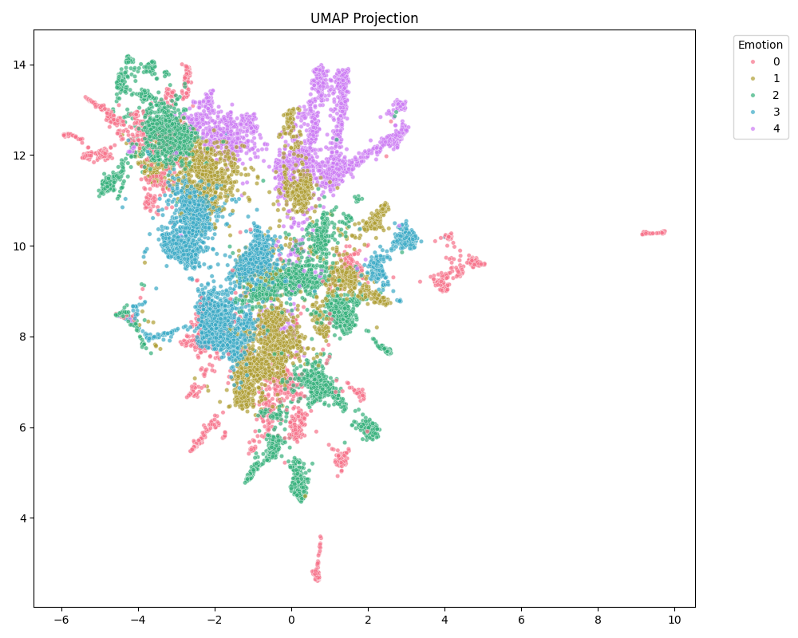
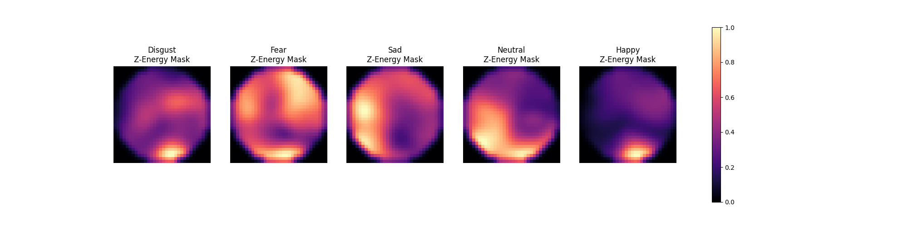

# 🧠 SWEEP-Net
**Spiking Weakly-supervised EEG Emotion Prototyping Network**

*A parameter-efficient, topologically explainable Brain-Computer Interface (BCI) designed to overcome cross-session EEG impedance gaps and anatomical variance.

*[Read the Paper (Coming Soon)] • [View Milestone Notebook](milestones/Project%20Milestone%201.ipynb)

---

## Overview
Current deep learning BCIs struggle with two major flaws: **Session Gaps** (overfitting to daily impedance noise) and **Black-Box Classification** (failing to provide biologically grounded neuro-spatial explainability). Furthermore, dense analog models are highly power-inefficient for wearable deployment. 

**SWEEP-Net** solves this by converting raw 1D EEG into 5D spatiotemporal video tensors and processing them through a custom **Atrous-MobileNet Encoder**. By leveraging **Weakly-Supervised Contrastive Learning (WeakSupCon)** and a **Spiking U-Net Decoder**, the network achieves State-of-the-Art session-invariant representations while physically mapping the topology of human emotion.

---

##  Current Architecture (Milestone 1)
Our Phase 1 repository successfully implements a robust, session-invariant representation learning pipeline:
*    **Physics-Informed Preprocessing:** Continuous offline Wavelet Transforms combined with `log1p` and per-band IQR robust scaling to mathematically eliminate the $1/f$ power law imbalance and session-specific impedance shifts.
*    **Atrous-MobileNet Encoder:** A custom <1M parameter 5D spatiotemporal encoder. It utilizes strict Depthwise-Pointwise convolutions to isolate EEG frequency bands, combined with Atrous (Dilated) Convolutions in deep stages (`[2, 3, 3, 2]` block schedule) to capture long-range fronto-parietal connectivity without losing spatial resolution.
*    **5D Temporal Dynamics:** A zero-FLOP Bidirectional Temporal Shift Module (Bi-TSM) to model macro-temporal emotion envelopes across 32 frames.
*    **Contrastive BCI Augmentations:** A custom PyTorch augmentation suite including `FrequencyDropout` (simulating bad bands) and `VideoTemporalMasking` (contiguous tube masking to simulate sensor disconnects) to drive the Supervised Contrastive Learning (SupCon) loss.

---

##  Project Roadmap (Upcoming Phase 2 & 3)
To resolve the biological entanglement of high-arousal negative-valence emotions (Fear/Disgust) and achieve true topological explainability, the following innovations are currently in development for the final submission:
*   **Density-Adaptive TopoMapping:** Resolving Euclidean spatial distortion by using a t-SNE inspired binary search (Perplexity) to dynamically adjust Gaussian RBF variance based on local electrode density.
*   **Dynamic Routing (ODConv & GC-Blocks):** Upgrading the depthwise layers with Omni-Dimensional Dynamic Convolutions to adapt to cross-subject anatomical variance, and Global Context blocks for holistic brain-network integration.
*   **WeakSupCon via SwiGLU-MIL:** Upgrading from 1-second windows to Bag-Level learning. A Multiple Instance Learning (MIL) SwiGLU attention head will autonomously filter out neutral resting-state windows from trial bags.
*   **Spiking Topological Decoder:** Attaching a Spiking U-Net Decoder with high-resolution skip connections to decode 128D embeddings back into biologically accurate 2D Ground Truth Z-Energy Masks using Leaky Integrate-and-Fire (LIF) neurons.

##  Phase 1 Results: Contrastive Latent Space

*The UMAP projection below demonstrates the latent space (128D bottleneck) evaluated on a strictly held-out Leave-One-Subject-Out (LOSO) test set.*

  
  
<i><b>Figure 1:</b> LOSO Contrastive Representation. The model successfully segregates Valence extremes (Happy/Sad) into distinct manifolds while maintaining the neurobiologically accurate continuum of High-Arousal/Negative-Valence states (Fear/Disgust).</i>

---

##  Phase 2: Topological Reconstruction 

Unlike standard classifiers, SWEEP-Net visually outputs the predicted brain activation.

  
  
<i><b>Figure 2:</b> Ground Truth Z-Energy Masks generated via Statistical Salience (employed so bands don't overpower/cancel out each other)</i>

---
